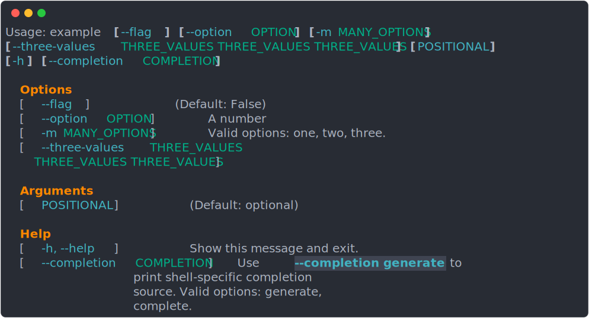

# Cappa

[](https://github.com/dancardin/cappa/actions)
[](https://codecov.io/gh/DanCardin/cappa)
[](https://cappa.readthedocs.io/en/latest/?badge=latest)

- [Full Documentation](https://cappa.readthedocs.io/en/latest/)
- [Comparison vs click/typer/argparse/etc](https://cappa.readthedocs.io/en/latest/comparison.html)
- [Annotations Inference Docs](https://cappa.readthedocs.io/en/latest/annotation.html)
- ["invoke" API Docs](https://cappa.readthedocs.io/en/latest/invoke.html)
- [Class Compatibility (dataclasses/pydantic/etc)](https://cappa.readthedocs.io/en/latest/class_compatibility.html)

Cappa is a declarative command line parsing library, which uses runtime type inspection
to infer (default) CLI argument behavior, and provide automatic [help text](https://cappa.readthedocs.io/en/latest/help.html)
generation and dynamic completion generation.

It supports two different modes of execution:

* `parse`: Argparse-like parsing of the arguments into an output structure
* [invoke](https://cappa.readthedocs.io/en/latest/invoke.html): Click-like calling
  of functions based on the selected subcommand

  It also provides a [dependency injection system](https://cappa.readthedocs.io/en/latest/invoke.html#Invoke-Dependencies)
  for providing non-argument resources to the invoked commands.

And, a number of different styles of CLI declaration (which can be mixed and matched within
a given CLI):

* Classes: The fields of the class correspond to CLI arguments/subcommands
* Functions: The arguments of the function correspond to CLI arguments
* Methods: The class fields correspond to CLI arguments, and the methods correspond to subcommands
* Imperative Construction: The CLI structure can be manually/imperitavely constructed,
  rather than being inferred from the input structure

<details open>
  <summary><h2>Class Based, parse</h2></summary>

  ```python
  from dataclasses import dataclass, field
  import cappa
  from typing import Literal
  from typing_extensions import Annotated

  @dataclass
  class Example:
      positional_arg: str = "optional"
      boolean_flag: bool = False
      single_option: Annotated[int | None, cappa.Arg(short=True, help="A number")] = None
      multiple_option: Annotated[tuple[Literal["one", "two", "three"]], cappa.Arg(long=True)] = ()

  args: Example = cappa.parse(Example, backend=cappa.backend)
  print(args)
  ```

  Produces the following CLI:

  

  In this way, you can turn any dataclass-like object (with some additional
  annotations, depending on what you're looking for) into a CLI.
  
  You'll note that `cappa.parse` returns an instance of the class. This API should
  feel very familiar to `argparse`, except that you get the fully typed dataclass
  instance back instead of a raw `Namespace`.
</details>

<details>
  <summary><h2>Class Based, invoke</h2></summary>

  ["invoke" documentation](https://cappa.readthedocs.io/en/latest/invoke.html)

  The "invoke" API is meant to feel more like the experience you get when using
  `click` or `typer`. You can take the same dataclass, but register a function to
  be called on successful parsing of the command.
  
  ```python
  from dataclasses import dataclass
  import cappa
  from typing_extensions import Annotated
  
  def function(example: Example):
      print(example)
  
  @cappa.command(invoke=function)
  class Example:  # identical to original class
      positional_arg: str
      boolean_flag: bool
      single_option: Annotated[int | None, cappa.Arg(long=True)]
      multiple_option: Annotated[list[str], cappa.Arg(short=True)]
  
  
  cappa.invoke(Example)
  ```
  
  (Note the lack of the dataclass decorator. You can optionally omit or include
  it, and it will be automatically inferred).
  
  Alternatively you can make your dataclass callable, as a shorthand for an
  explicit invoke function:
  
  ```python
  @dataclass
  class Example:
      ...   # identical to original class
  
      def __call__(self):
         print(self)
  ```
  
  Note `invoke=function` can either be a reference to some callable, or a string
  module-reference to a function (which will get lazily imported and invoked).

  ## Subcommands
  
  With a single top-level command, the click-like API isn't particularly valuable
  by comparison. Click's command-centric API is primarily useful when composing a
  number of nested subcommands, and dispatching to functions based on the selected
  subcommand.
  
  ```python
  from __future__ import annotations
  from dataclasses import dataclass
  import cappa
  
  @dataclass
  class Example:
      cmd: cappa.Subcommands[Print | Fail]

  
  @dataclass
  class Print:
      loudly: bool

      def __call__(self):  # again, __call__ is shorthand for the above explicit `invoke=` form.
          if self.loudly:
              print("PRINTING!")
          else:
              print("printing!")
  
  def fail():
      raise cappa.Exit(code=self.code)

  @cappa.command(invoke=fail)
  class Fail:
      code: int
  
  cappa.invoke(Example)
  ```
</details>

<details>
  <summary><h2>Functions, invoke</h2></summary>

  Purely function-based CLIs **can** reduce the ceremony required to define a given CLI
  command. Such a CLI is exactly equivalent to a CLI defined as a dataclass with the
  function's arguments as the dataclass's fields.
  
  ```python
  import cappa
  from typing_extensions import Annotated
  
  def function(foo: int, bar: bool, option: Annotated[str, cappa.Arg(long=True)] = "opt"):
      ...
  
  
  cappa.invoke(function)
  ```
  
  There are, however, some downsides to using functions. Namely, that `function`
  has no nameable type! As such, a free function can not be easily named as a
  subcommand option (`Subcommand[Foo | Bar]`).

  You **can** define a root level function with class-based subcommands, but
  the reverse is not possible because there is no valid type you can supply in
  the subcommand union.
</details>

<details>
  <summary><h2>Methods, invoke</h2></summary>

  See also [Methods](https://cappa.readthedocs.io/en/latest/functions_and_methods.html#methods).

  ```python
  from __future__ import annotations
  from dataclasses import dataclass
  import cappa
  
  @cappa.command
  @dataclass
  class Example:
      arg: int

      @cappa.command
      def add(self, other: int) -> int:
          """Add two numbers."""
          return self.arg + some_dep
  
      @cappa.command(help="Subtract two numbers")
      def subtract(self, other: int) -> int:
          return self.arg - other
  
  cappa.invoke(Example)
  ```

  With methods, the enclosing class corresponds to the parent object CLI arguments,
  exactly like normal class based definition. Unlike with free functions, (explicitly
  annotated) methods are able to act as subcommands, who's arguments (similarly to free functions)
  act as the arguments for the subcommand.

  The above example produces a CLI like:

  ```
  Usage: example ARG {add,subtract} [-h] [--completion COMPLETION]

  Arguments
    ARG

  Subcommands
    add                        Add two numbers.
    subtract                   Subtract two numbers.
  ```
</details>


<details>
  <summary><h2>Imperative Construction, parse/invoke</h2></summary>

  See also [Manual Construction](https://cappa.readthedocs.io/en/latest/manual_construction.html).

  ```python
  from dataclasses import dataclass
  
  import cappa

  @dataclass
  class Foo:
      bar: str
      baz: list[int]

  command = cappa.Command(
      Foo,
      arguments=[
          cappa.Arg(field_name="bar"),
          cappa.Arg(field_name="baz", num_args=2),
      ],
      help="Short help.",
      description="Long description.",
  )

  result = cappa.parse(command, argv=["one", "2", "3"])
  ```

  All other APIs of cappa amount to scanning the provided input structure, and producing
  a `cappa.Command` structure. As such, it's equally possible for users to manually
  construct the commands themselves.

  This could also be used to extend cappa, or design even more alternative interfaces
  ([Cleo](https://github.com/python-poetry/cleo) is another, fairly different, option
  that comes to mind).
</details>

## Inspirations

Credit where credit is due

* The "Derive" API of the Rust library [Clap](https://docs.rs/clap/latest/clap/_derive/index.html)
  directly inspired the concept of mapping a type's fields to the shape of the CLI, by inferring
  the default behavior from introspecting types.

* Click's easy way of defining large graphs of subcommands and mapping them to functions,
  inspired the the "invoke" API of Cappa. The actual APIs dont particularly resemble one
  another, but subcommands directly triggering functions (in contrast to argparse/Clap) is
  a very nice, and natural seeming feature!

* FastAPI's `Depends` system inspired Cappa's dependency injection system. This API is
  quite natural, and makes it very easy to define a complex system of ad-hoc dependencies
  **without** the upfront wiring cost of most DI frameworks.
